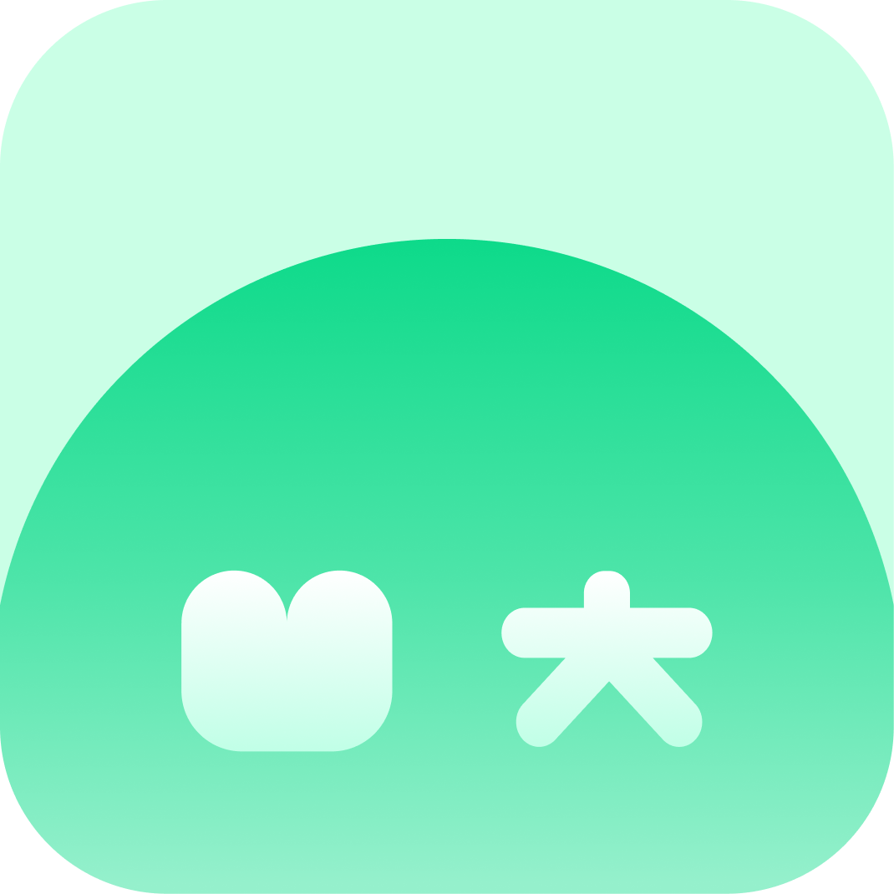
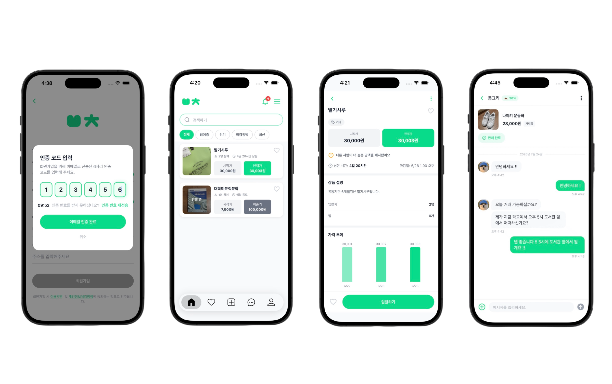
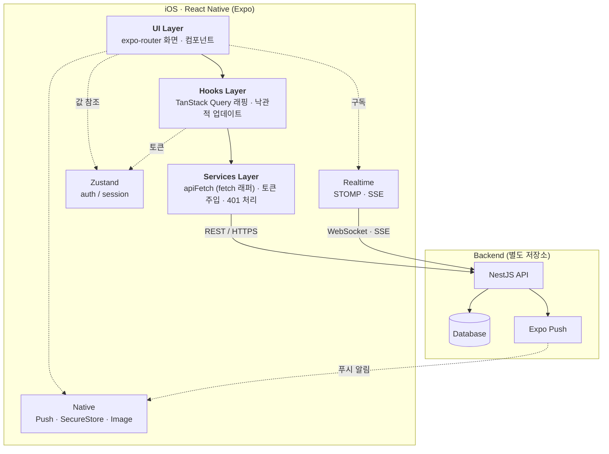
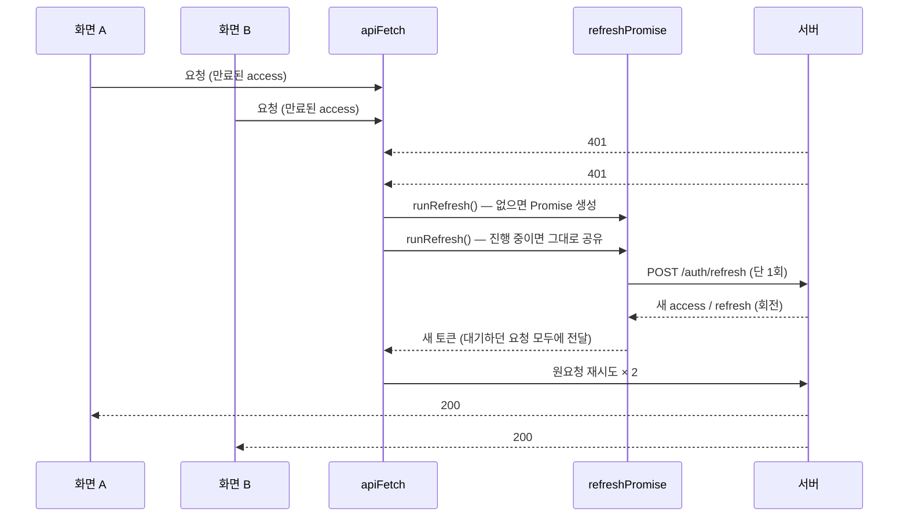
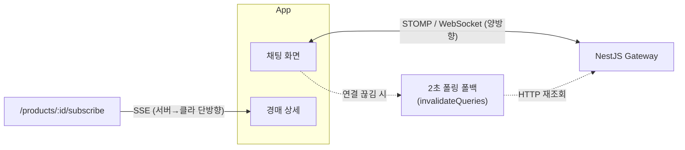

<!--
  README (작성: Claude Code 세션). 커밋 전 TODO:
  - 스크린샷 6장을 docs/screenshots/ 에 넣기 (아래 
 안 경로)
-->

 
 

밭찰

### 국립한밭대학교 구성원 전 중고 경매 거래 서비스

 

 

> **"모르는 사람 말고, 같은 학교 사람과 안전하게"**
>
> 밭찰은 학교 도메인 이메일 인증을 거친 한밭대학교 전용 중고거래 플랫폼으로, 
> 같은 학교 구성원과 안심하고 실시간 경매를 통해 물건을 사고팔 수 있는 iOS 앱입니다.

 

 
 

---

## Table of Contents

1\. [Project Overview](#project-overview) 
2\. [Key Features](#key-features) 
3\. [Tech Stack](#-tech-stack) 
4\. [System Architecture](#system-architecture)

 
 

---

## Project Overview

### Background

<table>
<tr>
<td width="33%" align="center" valign="middle">
<h3>1) 기존 커뮤니티의 한계</h3>

교내 커뮤니티(에브리타임 등)는 <b>거래보다 소통 중심</b>입니다. 익명 닉네임 기반으로 <b>책임감이 부족</b>하여, 거래 파기·연락 두절 등의 문제가 자주 발생합니다.

</td>
<td width="33%" align="center" valign="middle">
<h3>2) 신뢰의 부재</h3>

<b>불특정 다수</b>가 이용하는 개방형 플랫폼으로 <b>사기·허위 매물</b>의 위험에 노출됩니다. 또한 <b>상대 신원을 알 수 없어</b>, 심리적 불안감이 발생합니다.

</td>
<td width="33%" align="center" valign="middle">
<h3>3) 소액 거래의 거리 장벽</h3>

소액 거래의 경우, <b>거리적·시간적 비용</b>이 거래 금액보다 더 큰 부담으로 작용합니다.

</td>
</tr>
</table>

 

### Core Values

밭찰은 거래 대상을 단순 전공 서적에서 **자취·학습 용품 등 캠퍼스 필수품까지 확장**하고, 입찰 경쟁의 재미를 더하는 **경매 방식을 도입**하여 침체된 커뮤니티 거래를 활성화하는 데 집중했습니다.

<table>
<tr>
<td width="33%" align="center" valign="middle">
<h3>실시간</h3>

입찰가는 <b>SSE</b>로, 채팅은 <b>STOMP</b>로 실시간 반영. 연결이 끊겨도 폴링 폴백으로 <b>메시지를 잃지 않습니다.</b>

</td>
<td width="33%" align="center" valign="middle">
<h3>견고함</h3>

클라이언트를 <b>계층으로 분리</b>해, 백엔드가 두 번 바뀌는 동안에도 <b>화면 코드를 거의 건드리지 않았습니다.</b>

</td>
<td width="33%" align="center" valign="middle">
<h3>경험</h3>

낙관적 업데이트로 <b>즉각 반응</b>하고, Reanimated로 부드럽게. 앱이 꺼져 있어도 알림 딥링크가 <b>정확히</b> 열립니다.

</td>
</tr>
</table>

 
 

---

## Key Features

| 기능 | 상세                                                                     |
|:---:|:-----------------------------------------------------------------------|
| **🔐 캠퍼스 인증** | • 학교 도메인 이메일 인증 기반 가입 • JWT access/refresh 분리 + 토큰 회전, 비회원 둘러보기 모드 |
| **🔨 실시간 경매** | • 상품 등록·경매 기간 설정, 실시간 입찰 • 최고가·입찰 수가 SSE로 즉시 갱신, 낙관적 업데이트          |
| **💬 1:1 채팅** | • STOMP(WebSocket) 실시간 채팅 • 낙찰 후 채팅방 자동 생성, 거래 완료 상호확인             |
| **🔔 알림** | • Expo Push 푸시 + 인앱 알림함, 스와이프 삭제 • 콜드스타트 딥링크 라우팅, iOS 앱 배지 동기화     |
| **🔎 탐색** | • 캠퍼스 특화 카테고리, 키워드 검색 • 무한 스크롤 상품 목록                               |
| **🛡 안전** | • 사용자·상품 신고 / 차단, 정지 계정 처리 • 약관·정책 노출                              |

 
 

---

## 🛠 Tech Stack

| 구분 | 사용 기술 |
|---|---|
| **언어** | TypeScript 5.9 |
| **프레임워크** | React Native 0.81 · Expo SDK 54 · React 19 (New Architecture) |
| **라우팅** | expo-router 6 (파일 기반) |
| **서버 상태** | TanStack Query 5 |
| **클라이언트 상태** | Zustand 5 · Immer |
| **실시간** | STOMP over WebSocket (`@stomp/stompjs`) · SSE (`react-native-sse`) |
| **스타일·애니메이션** | NativeWind 4 (Tailwind) · Reanimated 4 · Gesture Handler |
| **네이티브** | expo-notifications · expo-secure-store · expo-image · expo-image-manipulator |
| **빌드·배포** | EAS Build / Submit · TestFlight → App Store |
| **DX** | React Compiler (annotation) · patch-package · ESLint · Prettier |

 
 

---

## System Architecture

UI가 서버 구현에 직접 묶이지 않도록 **`services → hooks → UI` 3계층**으로 분리하였습니다.

- **`services`** — 실제 네트워크 호출만 담당. 인증 토큰 주입·401 재시도·에러 봉투 파싱을 `client.ts` 한 곳에서 처리.
- **`hooks`** — `services`를 TanStack Query로 감싸 캐싱·낙관적 업데이트·재검증을 붙임. 화면은 이 훅만 사용.
- **`components` / `app`** — 훅이 주는 데이터로 그리기만 함. 서버 스펙을 모름.

 

<b>👉 인증 토큰 자동 갱신 흐름 (Single-flight) 구조</b>

 

동시에 여러 화면이 만료 토큰으로 요청해 401이 몰려도, **refresh는 딱 한 번만** 실행됩니다.

<b>👉 실시간 채널 분리 (STOMP · SSE · 폴백) 구조</b>

 

양방향 채팅과 단방향 입찰가의 특성에 맞춰 프로토콜을 나눴습니다.

 
 

밭찰 · 국립한밭대학교 구성원 전 중고 경매 거래 서비스

 